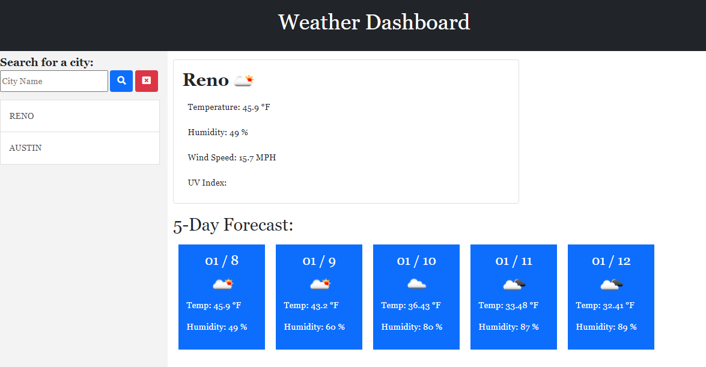

# Weather-Tracker
----------------------
## Description

Application will let user input city name and display weather information.

## Prerequisites

None

## Technologies Used

- HTML
- CSS
- Javascript

## APIs Used

- JQuery
- Moment.js
- Open Weather API

## Website Appearance




## Deployed Link
https://weilibryan.github.io/Weather-Tracker/

## Code Snippet
```
function retrieveInfo(selectCity) {
    var queryURL = "https://api.openweathermap.org/data/2.5/forecast?q=" + selectCity + "&units=imperial&appid=de496400dd500d58250dee54250a157f";

    $.ajax({
        url: queryURL,
        method: "GET"
      }).then(function(response) {
        console.log(response);
        $('#forecastCards').empty();
        setCityInfo(response);
        setForecast(response);
      });
};
```

## Authors

1. **William W. Bryan** 
- [Github](https://github.com/WeiLiBryan)
- [LinkedIn](https://www.linkedin.com/in/william-bryan-72730019a/)


## License

This project is licensed under the MIT License


## ACKNOWLEDGEMENTS

- [Stack Overflow](https://stackoverflow.com)

- [Open Weather API](https://openweathermap.org/)

- [Jquery](https://jquery.com/)
